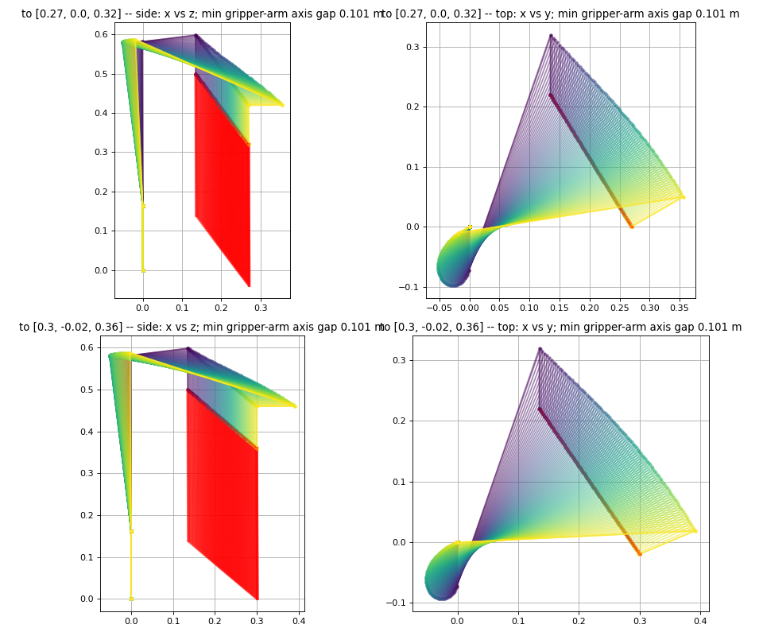

# Lab 2026-10-06: stereo calibration built, hardware calibration failed four times

**Read this before the next calibration.** The software from today is tested
and committed. The arm was stopped four times while calibrating, and the
operator ended the session. This record explains why, from evidence, and
what is now in place so it does not happen again.

## What was asked

Run the full demo (real arm, camera, detection). Pre-flight showed the ZED
had been taken off its mount, so the 10-02 calibration was invalid. Nikola
then asked for two things: use **both** lenses, and make calibration **cheap
to redo**, because the camera will keep moving.

## Built and verified in software (no arm motion needed)

| Piece | Where | Evidence |
|---|---|---|
| Lens re-alignment from any scene: SIFT matches + RANSAC, then fit only the two rotations that rows can see (RX, RZ). Toe-in (CV) stays from the factory file, because rows cannot see it. | `stereo.match_features`, `stereo.fit_row_rotation`; `lab_stereo_calibration.py rows` | On the real ZED: row error **33.1 → 0.74 px** (439 matches). Dense coverage 33 → 51 %. Same −1.63° tilt measured twice. 2 tests. |
| Eye-to-hand solver: target in the camera frame (stereo) vs flange pose (kinematics). Gives camera pose, target offset, optional disparity offset (the robot as ruler), robust to outliers, and reports what it could not pin down. | `ur7e_perception/handeye.py` | 11 tests: exact, noise, outliers, NaNs, disparity, degenerate wrist, yaw-only with a ruler-measured drop. |
| Stereo object locator: mask → 3-D points. A ring of plate around the object is the height reference, so a shared depth error cancels. Centre taken from the top band. | `stereo.locate_object`; `webcam_node` uses it when the calibration has a `stereo` section | 3 tests on rendered stereo (position < 6 mm, height < 5 mm, a wrong table plane cancelled). |
| Calibration file in **true** base_link units. The 10-02 file used a "wave frame" ~0.31 m off and relied on two errors cancelling. | `lab_stereo_calibration.py finish` | Keeps `lab_pick`'s contract: table + `tool_length` = 0.1485, the tips touchdown. |
| RG2 found by serial, not by URCap index. Today the URCap reported the same gripper at index 1, not 2. | `lab_rg2_native.find_by_serial`, `lab_pick.Rg2` | 1 test. Used on hardware. |
| scipy declared (package.xml, perception CI). | | The perception CI job did not install it. |

Suites at the end: perception 100 + 2, orchestrator 39, lab scripts 53.

## What happened on the arm

Times are local. Slider 26 → 75 %. Hat held by the brim (51 mm grip), plate
not cleared.

| # | Move | Result | Code | Cause |
|---|---|---|---|---|
| 1 | Stereo wave v1, stop 1 → 2: translation **plus** a 100° wrist yaw (+50° → −50°) | Nikola stopped it ("going to slam into itself") | C153A5 | See analysis |
| 2 | Stereo wave v2, approach `front` → (0.27, 0.00, 0.32), straight line, tool vertical | Nikola: "you were going to hit the robot again" | C153A3 | See analysis |
| 3 | 10-02 wave, stop 3 → 4: 10 cm sideways at flange 0.27 m | **Hat hit the block tower** (confirmed) | C153A2 | Objects on the plate are not in the planning scene |
| 4 | 10-02 wave, approach `front` → (0.30, −0.02, 0.36), grid moved away from the base | Stopped 2/3 of the way | C153A4 | See analysis |

C153 means "position deviates from path"
([UR manual](https://www.universal-robots.com/manuals/EN/HTML/SW5_23/Content/prod-err-codes/topics/CODE_153.html)).
The robot was pushed off its commanded path, by contact or by a hand. The
suffix is the joint that noticed it.

## Analysis: why the arm kept heading into itself

`scripts/lab_path_audit.py` (new) replays a planned move offline and runs
forward kinematics for **every link** at every waypoint. It needs no motion.
Results for the two approaches that executed:

```
to (0.27, 0.00, 0.32): max tilt 0.2 deg, wrist_2 travel 0.001 rad, pan 1.05, wrist_3 1.05,
                       min gripper-to-arm axis gap 0.101 m, at the START (front)
to (0.30, -0.02, 0.36): same picture, gap 0.101 m at the start
```



1. **The plans were what they claimed:** straight tool lines, tool vertical
   to 0.2°. **The arm did not follow them.** After stop 2 it stood 17°
   tilted, with wrist 2 0.25 rad off a plan that moves wrist 2 by 0.001 rad.
   So something pushed it, which is exactly what C153 reports. It was not a
   wrong trajectory being sent.
2. **`front` is a folded, elbow-out posture.** The elbow sits *beyond* the
   gripper, and the forearm folds back over it. The gripper axis starts only
   **~10 cm (axis to axis) from the arm's own forearm.** The gripper body is
   about 16 cm wide and the hat brim about 17 cm, so anything held there is
   practically touching the forearm. An approach then swings the elbow about
   60° (pan 1.05–1.17 rad, with wrist 3 counter-rotating by the same amount)
   and sweeps the forearm over the held object. To the operator that is the
   arm folding into itself. To the controller it is an outside force, C153.
3. **The planner could not see it.** The 10-02 wave does not model the held
   object at all. The stereo wave's hat box was a neat box under the
   fingertips, not the real brim. Objects on the plate (the tower) are in no
   model either.
4. **10-02 got away with the same start pose.** That wave also started from
   `front` with the same hat. It worked three times, so it is not evidence
   the pose is safe.

## My process failures (the part that made it four, not one)

- Treated "the planner found it collision-free" plus joint-excursion numbers
  as proof a new motion was safe. Neither shows where the links sweep.
- Ran new motion patterns at 75 % with the operator as the safety net,
  instead of previewing first and running slowly the first time.
- After stop 1, changed the motion pattern but not the start pose, and the
  start pose was the actual problem.
- The 10-02 wave carried on to the next pose after a failed execution.
  It now aborts.
- Did not clear the plate before a wave that passes 2 cm above it.

## What is now enforced in code

- **Gripper-to-arm sweep gate:** every planned wave move is checked link by
  link (`lab_path_audit.check_gap`). It is refused if the gripper axis
  passes within **0.15 m** of the arm's upper-arm or forearm axis anywhere
  along the path. Verified plan-only: from `front` the approach is now
  refused ("gripper passes 0.101 m from the arm's own links") and the wave
  aborts with zero motion.
- **Joint limits per move** (stereo wave): arm joints ≤ 0.35 rad, wrists
  ≤ 0.9 rad. The approach gets 1.2 / 1.2.
- **Stereo wave shape:** pure translations, or wrist 3 yawing 35° in place.
  No tilts.
- **The held target is attached to the planning scene** (stereo wave).
- **Abort on any execution failure** (both waves).
- **Plan-only rehearsal:** `wave --from-pose NAME` plans the whole wave from
  a pose without going there.

## Next session: pick up the calibration here, in this order

1. **Clear the plate completely.** The hat passes over it.
2. **Do not start from `front`.** With nothing in the gripper, use the
   console teleop (`let me drive it`) or freedrive to put the arm in an
   **open** posture over the front edge of the plate: elbow up and back
   toward the base, forearm well above the gripper, tool straight down,
   flange about 0.40 m high. Then `/teach calib_start` in the console and
   copy its joints from `scripts/.console_poses.json` into
   `scripts/lab_poses.json`. The calibration and audit scripts read only
   that seed file.
3. **Audit before moving:**
   `python3 scripts/lab_path_audit.py --from-pose calib_start --to <first stop>`.
   The gap must be ≥ 0.15 m (the gate enforces it anyway), and look at the
   picture.
4. **Plan-only rehearsal:**
   `python3 scripts/lab_stereo_calibration.py wave --from-pose calib_start`.
   Every line must be `PLAN`.
5. **Measure the hat drop with a ruler** (flange face to the hat's centre;
   10-02 implies ~0.312 m), and pass it as `solve --target-drop` (required).
   The wave is yaw-only, which cannot reveal that number by itself.
6. **First real run at 25 % slider,** a hand on the pendant. Then `rows`,
   hand-over, `wave --execute`, `solve`, `finish`, `check`.
7. Only then the pick demo (`lab_console.py --pick`).

The camera pose changes are what stereo calibration is for. None of the
four stops had anything to do with the camera.

## Later on 2026-10-06: gate fix, `calib_start`, and the next step

- **The gripper-gap gate could never pass.** It measured to the `wrist_1`
  joint, which carries the gripper about 0.14 m off its axis in every
  top-down pose, so the gap topped out at 0.141 m against a 0.15 m minimum.
  With Nikola's approval it now treats only the first 70 % of the
  elbow-to-wrist line as forearm (`FOREARM_REACH` in `lab_path_audit.py`).
  `front` still fails (0.104 m).
- **`calib_start`** was placed by hand and saved in `scripts/lab_poses.json`
  (final version: gap 0.164 m, tool straight down, flange about
  (0.14, 0.27, 0.29) m). Under the later 0.17 m gate it is **refused**, and
  it should not be used: see below.
- **Definite next step: mount the ZED rigidly to the robot's stand.**
  Camera and base then move together, the calibration holds for good, and
  each session only runs `check`. Tracked as plan task 2.5b in
  `docs/IMPLEMENTATION_PLAN.md`.

## Evening 2026-10-06: wave from the folded pose, two stops, freedrive capture

Nikola chose to calibrate from the folded `calib_start` at 100 % speed,
standing at the pendant. What happened, in order:

- **Wrist 3 at -6.20 rad blocked all planning.** The lab MoveIt config caps
  it at ±6.133 rad, and OMPL rejects a start state outside the cap. A
  wrist-3-only move to -5.90 fixed it. Check this first whenever planning
  fails with "invalid bounds" / code 99999.
- **`/compute_cartesian_path` is unsafe here.** A 6 mm step became 2020
  waypoints that swung the shoulder a full turn (the joint gate refused
  it). Wave moves now use seeded IK + a collision-checked joint line
  (`plan_pose_joint`). Measured with `log/base_clearance.py`: tool path
  within 1.7 mm of straight.
- **The local grid gave only 3–5 plannable stops.** The arm is folded:
  opening it brings the forearm in, and going lower puts the hat into the
  platform.
- **Run 1 was stopped by Nikola**: the hat came about 10 cm (surface to
  surface) from the base column.
- **Run 2: protective stop C153A3 on a 35° wrist turn.** Nikola: **the RG2
  fingers hit the arm, every time a warning came, in all the stops.** The
  gripper model was a 0.16 x 0.09 m box with jaws along tool0 X. Which way
  the real fingers open was never checked, and on paper there was ~2 cm of
  room. Fixed by making the envelope **square, 0.20 x 0.20 m**, in
  `lab_arm_moveit.launch.py`, and raising the gripper gate to **0.17 m**.
- **Freedrive calibration added**: `lab_stereo_calibration.py capture`
  (Enter records a stop, no motion), plus solve options `--min-stops` and
  `--target-on-axis`.
- **The camera was repositioned**; the old images were deleted.
  `rows.json` (lens-to-lens) was kept.
- **The freedrive solve with the hat failed** (best 54 mm RMS; 7–8 stops).
  The hat is a bad target: gripped by the brim, its centre is off the
  tool axis by an unknown amount (solved 28 ± 22 cm); its visible centre
  shifts with the viewing angle; and it is blue like the robot's joint caps
  (stop 6 detected a cap).

## Next session, in this order

1. **Calibrate with a small GREEN ball** (4–6 cm) held at the fingertips,
   by freedrive:
   `lab_stereo_calibration.py capture --target-color green`, 10+ stops
   spread across the view with varied tilt and yaw. Green, because blue
   matches the joint caps and red matches the clamp handles. Measure
   flange face to ball centre. Then
   `solve --target-drop <m> --target-on-axis`, `finish`, `check`.
   The camera has not moved since the evening capture, so `rows` stays valid.
2. **Demo run + screenshots for the repo** (language → detect → pick),
   Nikola's goal.
3. **Rigid camera mount** (plan task 2.5b).
4. Do **not** use the folded `calib_start` for motion. Starts must pass the
   0.17 m gate. Any new motion: sweep picture in RViz first.
